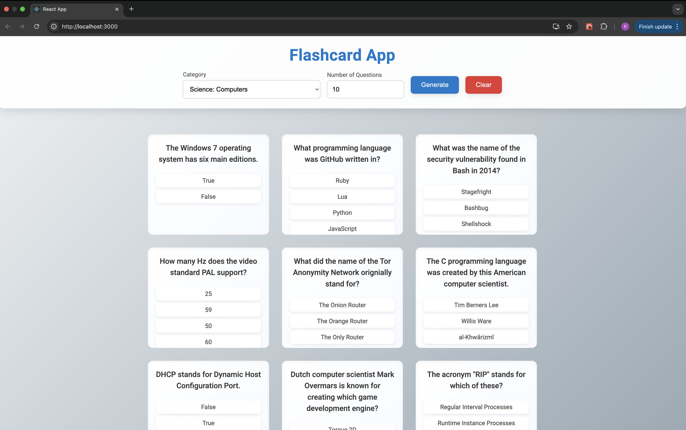

# 📚 Flashcard Quiz App

An interactive and responsive flashcard quiz app built with **React**.  
It fetches trivia questions from the **Open Trivia DB API**, lets users pick categories and number of questions, and displays the questions with animated flip-card effects.

Designed with a sleek, premium UI for a smooth user experience.

---

## 🖼️ Screenshot

Here’s a preview of the Flashcard App in action:



---

## ✨ Features

- 🎯 Fetches trivia questions live from [Open Trivia DB](https://opentdb.com/)
- 🧠 Flip cards to reveal answers
- 🗂️ Select quiz category and question count
- 📱 Fully responsive layout
- ⚙️ Built 100% in React (functional components + hooks)

## 🧪 Tech Stack

- **React**
- **JavaScript (ES6+)**
- **Axios**
- **CSS3 (custom styles)**
- **Open Trivia DB API**

---

## 🛠️ Getting Started

Clone the project and install dependencies:

```bash
git clone https://github.com/Islam7681/flashcard-app.git
cd flashcard-app
npm install
npm start
